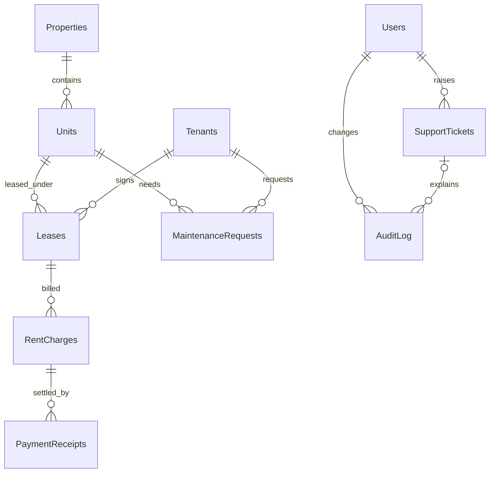

# PropertyPulse

A SQL-focused property management and application-support portfolio project inspired by property-management workflows. The dashboard combines an attributed National Housing Bank market snapshot with privacy-safe generated operations. Independent educational software, not a Yardi product or Voyager replica.

**Live demo:** https://property-pulse-wine.vercel.app  
**Source:** https://github.com/LostHardik/PropertyPulse

**Stack:** Node.js 22, Express, Microsoft SQL Server 2022, React, Recharts. All six SQL-backed reporting queries are handwritten T-SQL with no ORM or SQLite replacement. The Vercel portfolio adapter uses the same API with resettable generated operations so public visitors cannot damage a persistent database.

## What is included

- Versioned SQL migrations, constraints, foreign-key indexes, 956 deterministic privacy-safe operational rows and an attributed public housing-market snapshot.
- Property, unit, tenant, lease, rent-charge, receipt, maintenance and ticket CRUD.
- JWT authentication, administrator writes, read-only viewers, audited changes.
- Six reports, occupancy and collection charts, searchable PDF and Excel exports.
- Ticket investigation and an atomic correction + resolution workflow.
- Unit/API tests, separate SQL integration tests, and an executable index benchmark.

**Verification:** 25 unit/API/Vercel-demo tests passed, including both direct demo roles, public-data attribution, anonymized records and write protection. The production frontend bundle passed in the build environment. API tests use a repository double; they do not verify SQL Server. No SQL Server or Docker runtime was available there, so migrations, SQL integration tests, containers and index measurements have not been executed. Run the SQL gate below before describing the project as fully verified.

## Data provenance and privacy

The market panel uses factual annual Housing Price Index changes published by the **National Housing Bank** in its [NHB RESIDEX release for the quarter ended March 2026](https://www.nhb.org.in/wp-content/uploads/2026/06/National-Press-Release-RESIDEX-Mar26.pdf). The source snapshot, publication date, methodology note and values are preserved in `data/nhb-residex-march-2026.js`; the SQL-backed application stores the rows through migration `003_market_benchmarks.sql`.

Property names, units, rents, tenants, leases, charges, receipts, maintenance requests and tickets are generated demonstrations. Real Pune and Mumbai neighbourhood names provide geographical context, but no real address, person, contact detail, lease, payment reference or complaint is included. Tenant identifiers use the reserved `.invalid` email domain and explicit anonymous labels.

## Deploy the safe Vercel portfolio demo

The Vercel API entry point (`api/[...path].js`) uses the resettable in-memory repository exported by `index.js`. It exposes the complete UI, both roles, reports, exports and support workflow without connecting public visitors to the SQL database. Changes may reset between requests or deployments and must not be treated as persistent records. The full SQL Server implementation continues to run through `server/index.js`.

1. Push this folder to a GitHub repository and import it at [vercel.com/new](https://vercel.com/new).
2. Add a production environment variable named `JWT_SECRET` containing a random value of at least 32 characters.
3. Keep the included build, output and API rewrite settings from `vercel.json`; Vercel builds the Vite client into `public/` and routes `/api/*` to the exported Express application.
4. Deploy, then verify `/api/health`, both role buttons, the NHB market panel, reports and exports.

Use Node.js 22.x. No database credential is required for the public Vercel demo. For a persistent SQL-backed deployment, use `server/index.js` on a long-running Node host with Azure SQL or SQL Server and keep `DEMO_MODE=false` unless the database contains disposable sample data.

## Start on Windows with Docker Desktop

Use Linux containers and Node.js 22.13 or newer. Open a terminal in this folder. The SQL Server image requires an x86-64 environment; ARM hosts need a compatible SQL Server elsewhere.

1. Copy `.env.example` to `.env` (`Copy-Item .env.example .env` in PowerShell).
2. Set `DB_PASSWORD` to a strong SQL Server password with upper/lowercase letters, numbers and symbols. Set different `ADMIN_PASSWORD` and `VIEWER_PASSWORD` values, each at least 12 characters. Replace `JWT_SECRET` with a random secret of at least 32 characters. One local generation command is `node -e "console.log(require('crypto').randomBytes(48).toString('hex'))"`.
3. Review the [Microsoft SQL Server container license information](https://learn.microsoft.com/en-us/sql/linux/quickstart-install-connect-docker?view=sql-server-ver17). Set `ACCEPT_EULA=Y` only after accepting the terms. Developer edition is for development/testing.
4. Run these commands in order:

```powershell
docker compose up -d db
docker compose build app
docker compose run --rm app node scripts/migrate.js
docker compose run --rm app node scripts/seed.js
docker compose up -d app
```

Open **http://localhost:3000** and choose **Continue as Administrator** or **Continue as Viewer**. The buttons are available while `DEMO_MODE=true`; use that setting only with disposable demonstration data. Password authentication remains in the API for production-style testing, but the portfolio interface does not display credential fields. Refreshing the browser returns to the role chooser because the token is kept only in memory.

Select **2026-09-04** as the report date to reproduce the documented dataset. The seeded data is fixed rather than relative to the clock. Initial seeding refuses a nonempty Users table; migration execution is repeatable. Later `.env` password edits do not change already-seeded accounts.

`docker compose down` stops services and keeps the database volume. Do not remove that volume if you want to retain your records. SQL Server can take a minute or more to become healthy. If port 1433 is already occupied, use your existing SQL Server with the manual setup below or change the published port and the host `.env` DB_PORT together.

## Existing SQL Server / local development

Install/use SQL Server Developer and optionally SQL Server Management Studio. Enable TCP/IP and set its TCP port, then restart the SQL Server service if required. Set `.env` connection credentials for an account allowed to create the development database. This driver uses SQL authentication. See the [Microsoft Node.js connection guide](https://learn.microsoft.com/en-us/azure/azure-sql/database/azure-sql-javascript-mssql-quickstart?view=azuresql).

```powershell
npm ci
npm run db:migrate
npm run db:seed
npm run build
npm run dev
```

Open http://localhost:3000. For frontend hot reload, keep `npm run dev` running and run `npm run dev:web` in a second terminal; Vite prints its development URL and proxies `/api` to port 3000.

`npm start` expects environment variables supplied by the host. `npm run dev` loads `.env`. Never commit `.env` or real tenant information. No credentials are bundled.

## Data model and business rules



The exact columns, checks and indexes are in `db/migrations`. Tickets also reference one allowlisted business record using `related_table` and `related_id`; this polymorphic reference is validated by the API, not a SQL foreign key.

Money is stored as integer **paise**, avoiding floating-point currency arithmetic. ₹17,500 is `1750000`. Forms display rupees; API and exported report columns ending in `_paise` contain paise. Date-only business fields use ISO `YYYY-MM-DD`; ticket/audit timestamps use UTC.

RentCharges and PaymentReceipts intentionally replace a single Payments table: one bill can have partial or multiple receipts. Balances and paid/late/pending status are derived for the selected date. Due today is pending; overdue means due before that date with positive balance. A payment received late is not an outstanding debt once settled. Unit occupancy and property total units are also derived, preventing contradictory stored flags.

Lease intervals include both start and end dates. Noncancelled leases cannot overlap on a unit; ended leases still count in historical reports. Move-out should be represented by the actual end date. Charges must fall inside the lease. Receipts cannot predate the lease or exceed the charge in aggregate; future-dated receipts are rejected. Database triggers enforce these ledger rules, including direct SQL writes. Foreign keys prevent orphaning records.

Writes run in a serializable transaction with a transaction-owned, database-scoped `sp_getapplock` named `PropertyPulseLedger`. Triggers acquire the same lock. The coarse lock deliberately favors correctness and explainability over throughput. Direct concurrent SQL writers can deadlock; SQL Server rolls a victim back rather than accepting conflicting leases. A production design should introduce carefully ordered per-unit/per-charge locks and bounded retries after load testing. [Microsoft application-lock documentation](https://learn.microsoft.com/en-us/sql/relational-databases/system-stored-procedures/sp-getapplock-transact-sql?view=sql-server-ver17).

## Reports and SQL walkthroughs

Every report accepts one parameter, `@asOf`, through bound SQL parameters.

| Report | Definition and technique |
|---|---|
| Rent roll | Available units LEFT JOIN the tenant/lease valid on the date; vacant units remain visible. Listed and contracted rent are separate. |
| Overdue | Aggregate receipts through the date, subtract from each bill, retain positive past-due balances; DENSE_RANK by days overdue then balance. |
| Occupancy | Recursive 12-month date series, property cross join, date-aware LEFT JOINs; month-end snapshots except the current partial month. |
| Expiry | Current leases ending within 90 days; mutually exclusive 0–30, 31–60 and 61–90 day buckets. |
| Maintenance | Correlated property averages and HAVING against the request-weighted portfolio average. |
| Collection | Cash actually received each month; SUM OVER with an explicit running ROWS frame. Zero-collection months are retained. |

### Occupancy: preserve missing months and vacant units

Read `db/reports/occupancy.sql`. The recursive CTE generates month starts from eleven months before `@asOf` through its month. Snapshot dates are each completed month's last day; the current month uses `@asOf`, avoiding future occupancy. Crossing properties with this series first creates every property/month combination. LEFT JOIN Units then Leases keeps vacant units and empty properties. Unit availability and lease validity conditions stay in JOIN clauses: moving them into WHERE would remove unmatched rows and silently inflate occupancy. Count units for the denominator and matching leases for the numerator. The nonoverlap constraint ensures one unit does not join multiple valid leases. Zero inventory produces NULL percent, rather than a misleading 0%.

This is a snapshot metric, not occupied unit-days divided by available unit-days. Changing that business definition requires a different report.

### Maintenance: compare against a weighted portfolio average

Read `db/reports/maintenance.sql`. First calculate resolution duration for resolved requests through `@asOf`. The portfolio average is over requests, so a property with many requests receives proportionate weight; it is not an average of property averages. A grouped CTE uses HAVING to identify properties above this portfolio average. The outer property query uses correlated subqueries to expose each property's count and average, and marks membership in that slow-property set. Properties with no completed requests remain visible with NULL average and a false flag. Seeded property averages are 2, 4, 6 and 8 days; the portfolio average is 5 days.

Historical finance is reconstructed using receipt dates and lease dates. This is not a bitemporal warehouse: edits to old records change historical reports. AuditLog preserves API changes but is not a temporal reporting engine. Ticket counts show current workflow state even when a historical report date is selected.

## Ticket demonstration

1. Sign in as admin and open Tickets. Investigate a seeded unit ticket.
2. Review the record, contracted/listed rents, and audit history. A rent difference can be legitimate; check the lease before editing.
3. Enter meaningful resolution notes. Use Correct record & resolve to change the related unit's listed rent, or resolve without correction.
4. The correction and ticket resolution commit together; a failed constraint rolls both back. Audit entries capture before/after JSON and the actor. The ticket receives a UTC resolved timestamp.
5. Sign in as viewer and verify that records/reports remain readable while all write actions are blocked by the backend.

Creating a ticket is an admin write in this two-role model. A future tenant role could be allowed to raise tickets without editing business data. Diagnostics use allowlisted SQL only; users cannot submit arbitrary SQL. Direct database writes bypass API audit and polymorphic-ticket checks, so database permissions remain necessary.

## API reference

Send `Authorization: Bearer <token>` after login. Money values are integer paise. Entity identifiers are positive integers.

| Method and route | Access / purpose |
|---|---|
| GET `/api/health` | Public health response |
| POST `/api/auth/login` | `{email,password}` returns JWT; retained for API testing |
| POST `/api/auth/demo` | `{role: "admin"|"viewer"}` returns JWT when `DEMO_MODE=true` |
| GET `/api/auth/me` | Authenticated account |
| GET `/api/market-benchmarks` | Attributed NHB RESIDEX market snapshot; either role |
| GET `/api/kpis?asOf=2026-09-04` | Either role |
| GET `/api/reports/:name?asOf=2026-09-04` | Either role; six names from report table/files |
| GET `/api/reports/:name/export?asOf=2026-09-04&format=xlsx` | Either role; `pdf` also supported |
| GET `/api/entities/:entity?page=1&limit=25&asOf=2026-09-04` | Either role; limit max 200 |
| GET `/api/entities/:entity/:id` | Either role |
| POST `/api/entities/:entity` | Admin create |
| PATCH `/api/entities/:entity/:id` | Admin partial update |
| DELETE `/api/entities/:entity/:id` | Admin; foreign-key/reference protections apply |
| POST `/api/tickets/:id/investigate` | Admin diagnostics |
| POST `/api/tickets/:id/resolve` | Admin `{resolution_notes,correction?}` |
| GET `/api/audit` | Admin, most recent 200 changes |

Entity names: `properties`, `units`, `tenants`, `leases`, `charges`, `receipts`, `maintenance`, `tickets`. Field definitions are in `server/models.js`; Records forms display them. Account management is intentionally not exposed as generic CRUD. Tokens expire after an hour, and roles are rechecked against Users on every authenticated request.

## Tests and reproducible seed expectations

```powershell
npm ci
npm test
npm run build
# Requires reachable SQL Server and permission to create disposable databases:
npm run test:sql
npm run benchmark
```

For the last two commands use `TEST_DB_NAME=PropertyPulse_test` in `.env`. Each creates a unique database with that prefix and drops only its own database on completion; neither resets the application database. An interrupted process may leave its disposable database behind. Tests cannot use a name without the `_test` suffix.

| Seed value at 2026-09-04 | Expected |
|---|---:|
| Properties / units / tenants / leases | 4 / 40 / 36 / 36 |
| Charges / receipts / maintenance / tickets | 420 / 380 / 32 / 8 |
| Occupied units / occupancy | 32 / 80% |
| Rent-roll / occupancy / expiry rows | 40 / 48 / 3 |
| Overdue charge count | 138 |
| Overdue balance, paise | 228575000 |
| September collected, paise | 44925000 |
| 12-month collected, paise | 714025000 |

SQL integration tests assert exact report results, reject overlapping leases/overpayments, check atomic ticket changes, and exercise simultaneous conflicting leases. These assertions are supplied but were not executed in the build environment. Unit/API tests also verify role boundaries, invalid tokens, input validation and real PDF/XLSX generation.

## Index comparison: SQL Server equivalent of EXPLAIN ANALYZE

SQL Server uses actual execution plans and `SET STATISTICS IO/TIME`, rather than PostgreSQL's `EXPLAIN ANALYZE`. `scripts/benchmark.js` builds 200,000 synthetic receipts in an isolated database and executes a charge/date aggregate before and after adding `(charge_id, paid_date) INCLUDE(amount_paise)`, matching the application's receipt aggregation access pattern. It warms each plan, captures three measured runs, information messages and actual XML plans. Open `.sqlplan` files in SSMS.

| Comparison | Before index | After index |
|---|---|---|
| Logical reads | Not measured here | Not measured here |
| CPU / elapsed time | Not measured here | Not measured here |
| Actual plan | Generated by benchmark command | Generated by benchmark command |

Inspect `benchmark-output/results.json` and both plans after running. Compare logical reads and operators, not just wall-clock time, which includes driver/network overhead and varies with caching. A scan-to-seek reduction is an expectation to verify, not a claimed measurement. No global cache flush is performed. This isolated benchmark illustrates one access path; it is not a claim about full portfolio-report performance.

Application migrations index foreign keys, lease status/end dates, charge due dates and receipt dates. Payment status is derived, so there is no misleading persisted payment-status index. Real workload tuning should examine the actual unpaid-balance aggregation plan.

## Yardi trainee relevance and resume use

The supplied Yardi Software Engineer Trainee notice emphasizes SQL fundamentals, technical communication, application support, complex reporting, troubleshooting, optimization and testing. PropertyPulse demonstrates those through raw T-SQL reports, financial reconciliation, ticket diagnostics, audited corrections and reproducible test fixtures. SQL Server is a deliberate learning choice; the notice does not explicitly mandate it. React is a way to demonstrate the reports, not the main interview topic. Explain the lease-overlap invariant, weighted averages, joins that preserve vacant units and partial-payment accounting before adding advanced claims to a resume.

Suggested resume wording **after running the SQL tests and understanding the implementation**: “Built PropertyPulse using React, Express and SQL Server, combining attributed NHB RESIDEX market data with 956 privacy-safe operational records, six raw T-SQL reports, role-based access, partial-payment reconciliation and audited support-ticket resolution; implemented 25 unit/API/demo tests.” Do not claim the supplied SQL integration tests passed until you run them, and do not add measured performance improvements until you have actual benchmark results. A project can strengthen an application but cannot guarantee shortlisting.

## Deployment boundaries

Docker Compose here is a local development setup: localhost-bound ports, self-signed certificate trust and a privileged bootstrap account. The public Vercel adapter is deliberately resettable and is not a persistent system of record. A persistent deployment needs a supported SQL Server service, a long-running Node/container host, HTTPS, trusted database TLS, least-privilege runtime credentials, secret management and backups. SQL Server Developer licensing must be appropriate to the use. Never publish the database port or use `sa` as a production app account. Financial receipt deletion is included for CRUD learning; production accounting normally uses controlled reversals and immutable records.

The public repository excludes `.env` and contains placeholders only in `.env.example`. The live Vercel demo uses the resettable adapter and does not run the persistent SQL Server system.
